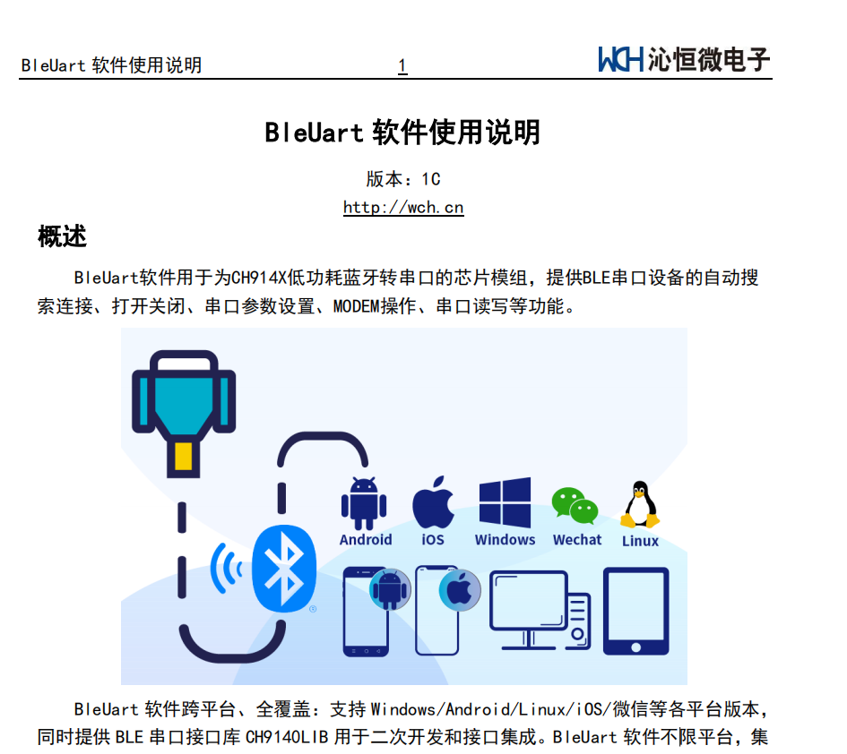
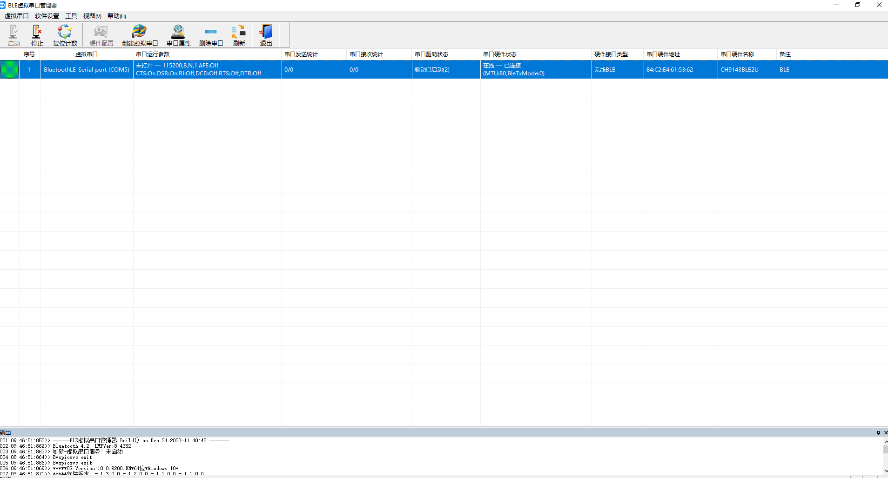

CH9140蓝牙串口模块使用

# 1.使用沁恒提供的APP或者WIN软件

https://www.wch.cn/products/CH9140.html

沁恒提供了全平台的软件，使用这些可以简单的测试模块的可用性。

# 2.正常使用——WIN蓝牙虚拟串口工具

正常使用时，使用沁恒提供的蓝牙虚拟串口工具，将BLE虚拟为WIN的一个串口之后，可以使用XCOM或者其他串口软件直接访问。

# 3.CH9140相关库下载

| 文件名                                                       | 功能                                                         |
| ------------------------------------------------------------ | ------------------------------------------------------------ |
| [CH9141DS1.PDF](https://www.wch.cn/downloads/CH9141DS1_PDF.html) | CH9141芯片手册，实现蓝牙串口双向传输，支持串口及蓝牙接口配置，并提供IO、ADC等功能方便串口设备实现蓝牙连接，电脑端提供BLE虚拟串口驱动，兼容常规串口应用程序和串口调试工具，无需二次开发，实现无线串口和串口延长功能。 |
| [BleUartLib.ZIP](https://www.wch.cn/downloads/BleUartLib_ZIP.html) | CH9140/CH9141/CH9143的各系统平台BLE串口接口库，用于为CH914X低功耗蓝牙转串口的芯片模组开发APP时调用。库提供BLE串口设备的自动搜索连接、打开关闭、串口参数设置、MODEM操作、串口读写、蓝牙控制器版本号查询等操作API函数。 |
| [BleUartApp.ZIP](https://www.wch.cn/downloads/BleUartApp_ZIP.html) | 软件为CH9140/CH9141/CH9143低功耗蓝牙转串口的CH914X芯片模组，提供BLE串口设备的自动搜索连接、打开关闭、串口参数设置、MODEM操作、串口读写等功能，提供Windows/Android/Linux/iOS/微信各平台版本。 |
| [WCHBleLib_MultiOS.ZIP](https://www.wch.cn/downloads/WCHBleLib_MultiOS_ZIP.html) | CH579/CH578/CH573/CH9143/CH9141/CH9140的各系统平台低功耗蓝牙开发接口库，提供BLE设备的枚举、扫描、连接和检测，蓝牙服务和特征的枚举、读写、订阅，控制器版本查询等API函数。支持Windows/Android/Linux/iOS/微信等各平台。 |